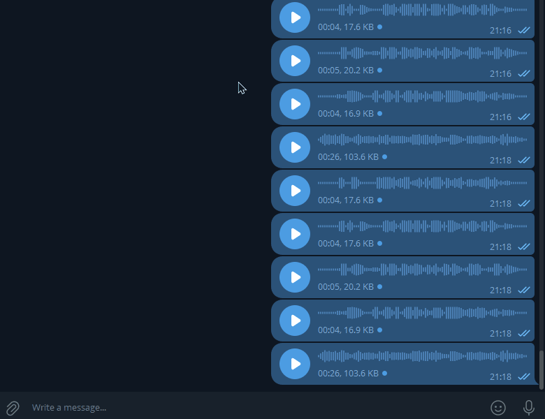

# TelegramBot_Whisper

Telegram bot for voice transcription and AI text processing.



The bot can:
- transcribe voice messages and video notes,
- summarize text from replied messages,
- generate a reply to text from replied messages,
- switch behavior per chat through an admin settings menu.

---

## Features

- **Speech-to-text** via Groq Whisper (`whisper-large-v3`)
- **Text summarization** via LLaMA-compatible API
- **AI reply generation** via LLaMA-compatible API
- **Async processing** with Celery + Redis
- **Per-chat settings** stored in PostgreSQL:
  - transcription mode (`Auto` / `Command`)
  - AI tone preset (`default`, `friendly`, `official`, `sarcastic`)

---

## Commands

### Summarize a replied text message
`!суть`, `!summary`, `/summary`, `выжимка`, `summary`, `!gist`, `!сенс`, `!коротко`

### Generate an answer to a replied text message
`!answer`, `!ответь`, `!reply`, `!відповісти`, `/answer`, `!ответ`, `!відповідь`

### Transcribe a replied voice/video note (when command mode is enabled)
`!транскрипт`, `!transcribe`, `/transcribe`, `!текст`, `!розшифрувати`, `!напиши`

### Open settings
`/settings`

> In group chats, only administrators can change settings.

---

## How transcription mode works

- **Auto mode (default):** any incoming voice/video note is transcribed automatically.
- **Command mode:** voice/video notes are transcribed only when you reply with one of the transcription commands.

---

## Tech stack

- [aiogram](https://github.com/aiogram/aiogram)
- [Celery](https://docs.celeryq.dev/) + [Redis](https://redis.io/)
- [PostgreSQL](https://www.postgresql.org/) + SQLAlchemy + Alembic
- [Groq API](https://console.groq.com/) for transcription
- LLaMA-compatible chat completions endpoint for text generation
- Docker + Docker Compose

---

## Run with Docker Compose

### Requirements
- Docker
- Docker Compose

### 1) Clone repository
```bash
git clone https://github.com/RiaLnN/telegramBot_whisper.git
cd telegramBot_whisper
```

### 2) Create `.env`
```env
BOT_TOKEN=your_telegram_bot_token
GROQ_KEYS=groq_key_1,groq_key_2
LLAMA_API_KEY=your_llama_api_key
```

`GROQ_KEYS` accepts one or multiple keys separated by commas.

### 3) Start services
```bash
docker compose up --build -d
```

This starts:
- `bot` (Telegram polling app)
- `celery` (background worker)
- `redis` (task broker)
- `db` (PostgreSQL)

---

## API keys

| Key | Where to get |
|---|---|
| `BOT_TOKEN` | [@BotFather](https://t.me/BotFather) |
| `GROQ_KEYS` | [console.groq.com](https://console.groq.com) |
| `LLAMA_API_KEY` | your LLaMA-compatible provider |
